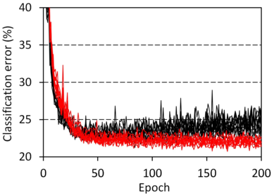

# Schizophrenia-mimcking layer
Schizophrenia-mimicking layer was inspired from our [study on nanometer-scale 3D brain network of schizophrenia patients](https://www.nature.com/articles/s41398-019-0427-4). The synchrotron raditation nano-CT analysis revealed that neurons of cingulate cortex are thin and tortuous in schizophrenia compared to healthy controls. Another area called [temporal cortex also showed similar results](https://arxiv.org/abs/2007.00212). So we translated these findings into specially designed layers that mimic connection impairment in schizophrenia. We prepared two types of schizophrenia mimicking layer: 'schizophrenia connection layer' and 'schizophrenia convolution layer'. The schizophrenia connection layer corresponds to schizophrenia-version fully-connected layer. The other one is self-explanatory. Very interestingly the schizophrenia connection layer completely suppresses overfitting and outperforms fully connected layer. Here is a typical example: <BR><BR>


## How to implement schizophrenia-mimicking layer in your network
Our original code runs on Tensorflow/Keras. 
1. Download 'schizo.py' file to your working directory where your *.py file is placed. 
2. The followin is a tutorial code using a 'SzDense' layer in place of fully-connected 'Dense' layer: 
```
from tensorflow import keras
from tensorflow.keras import layers
import schizo

model = keras.Sequential([
  layers.Flatten(),
  # layers.Dense(512, activation='relu', kernel_initializer='he_normal'),
  schizo.SzDense(512, reduction_ratio=0.5, activation='relu', kernel_initializer='he_normal'),
  layers.Dense(num_class, activation='softmax')
])
```
In this example, the `layers.Dense` hidden layer was commented out to replace it with a `schizo.SzDense` layer of 50% parameter reduction, which is defined with argument `reduction_ratio`. The best reduction ratio depends on your network configuration, but in most cases 50-80% seems to give good results. So we recommend 50% as a first choice. 

## Code used for our paper figures
under construction.

## Reference
will be presented
