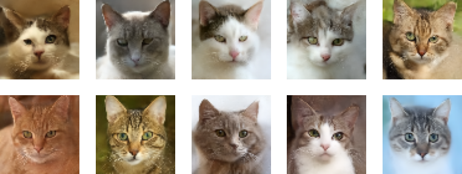

# Bio-mimetic layers
We have been studying brain tissues of <a href="https://dx.doi.org/10.1038/s41398-019-0427-4">humans</a>, <A href="http://doi.org/10.1038/srep35061">mice</A>, and <a href="http://dx.doi.org/10.1016/j.jsb.2013.08.012">fruit flies</a>. We implemented the obtained results into artificial neural networks to design architectures that outperform conventional AIs.

## Mouse-mimetic layer used in our study: Structural differences between human and mouse neurons...
Mouse-mimetic layer is based on [our study on nanometer-scale 3D structures of mouse brain tissues](https://arxiv.org/abs/2410.20735) and also on [those of human](https://journals.plos.org/plosone/article?id=10.1371/journal.pone.0287646). We implemented the mouse-mimetic convolutional layers in generative AIs and found that the mouse AI excels at generating cat face and cheese photos, but underperforms for human faces and birds. Python scripts used in our <a href="https://arxiv.org/abs/2410.20735">study</a> which run on Keras 3.3 are available from the <a href="https://github.com/mizutanilab/biomimetic-nn/tree/master/mouse">mouse</a> folder. Its PyTorch version and example results in the Jupyter Notebook format are also provided in the <a href="https://github.com/mizutanilab/biomimetic-nn/tree/master/mouse_pytorch">mouse_pytorch</a> folder. The followings are cat-face images generated with the DDIM using the mouse-mimetic layers. <BR><BR>


## How to implement the mouse-mimetic layer in your network
Our code was originally developed using Tensorflow 2.16 / Keras 3.3 and also tested on TF 2.18 / Keras 3.10. A [PyTorch version](https://github.com/mizutanilab/biomimetic-nn/tree/master/mouse_pytorch) is also available. Their usage is the same with the standard layers, except for specifying the %usage of weights and its reduction method. The reduction method for the mouse layer is `2d` and its recommended window width is 0.4-0.6, which corresponds to the parameter %usage of 35-60%. 
1. Download `mouselayers.py` or `mouselayers_pytorch2_7.py` file to your working directory where your *.py file is placed.  
2. The following is a Keras example code using a `mConv2D` layer in place of the `Conv2D` layer: 
```
import keras
from keras import layers
import mouselayers as mouse

model = keras.Sequential([
  layers.Dense(4 * 4 * 1024, activation='relu'),
  layers.Reshape((4, 4, 1024)),
  # layers.Conv2D(512, kernel_size=5, strides=2, padding='same'),
  mouse.mConv2D(512, form='2d', input2d_width=32, output2d_width=32, window2d_width=0.5, kernel_size=5, strides=2, padding='same'),
  layers.Activation('relu'),
  layers.Dense(num_class, activation='sigmoid')
])
```
In this example, the `layers.Conv2D` layer was commented out to replace it with a `mouse.mConv2D` layer of about 50% weight usage, which is defined with argument `window2d_width`. The %usage best fit to your application depends on a variety of factors, but in most cases 30-50% seems to yield good results. We recommend `window2d_width=0.5` as a first choice. The arguments `input2d_width` and `output2d_width` should be close to the square root of channel dimensions of input and output layers, respectively. No other modification of your python code is required. 

## The original schizophrenia-mimicking layer
The original schizophrenia-mimicking layer is based on our [study on nanometer-scale 3D structure of neuronal network in schizophrenia cases](https://www.nature.com/articles/s41398-019-0427-4). We translated the findings into newly designed layers that mimic connection constraints in schizophrenia. Please find the code used in that paper <a href="https://github.com/mizutanilab/biomimetic-nn/tree/master/FrontNeurorobot">here</a>.<BR>

## Release notes
2025.7.10 Release of PyTorch version 'mouselayers_pytorch2_7.py'. Keras version 'mouselayer.py' was updated to run on Keras 3.10.<BR>
2024.10.29 Fully revised in response to the release of mouselayers.py<BR>
2020.9.24 Release of this repo.

## References
Saiga et al (2025). Structural differences between human and mouse neurons and their implementation in generative AIs. <i>Sci. Rep.</i> in press. <a href="https://arxiv.org/abs/2410.20735">arXiv</a><BR>
Mizutani et al (2022). Schizophrenia-mimicking layers outperform conventional neural network layers. <i>Front. Neurorobot.</i> <b>16</b>, 851471. <a href="https://doi.org/10.3389/fnbot.2022.851471">DOI</a><BR>
Mizutani et al (2021). Structural diverseness of neurons between brain areas and between cases. <I>Transl. Psychiatry</I> <B>11</B>, 49. 
 <a href="https://doi.org/10.1038/s41398-020-01173-x">DOI</a>
 <a href="https://www.nature.com/articles/s41398-020-01173-x.pdf">pdf</a><BR>
Mizutani et al (2020) Schizophrenia-mimicking layers outperform conventional neural network layers. [arXiv](https://arxiv.org/abs/2009.10887)<BR>
Mizutani et al (2019) Three-dimensional alteration of neurites in schizophrenia. <i>Transl Psychiatry</i> <b>9</b>, 85. [nature.com](https://www.nature.com/articles/s41398-019-0427-4)

