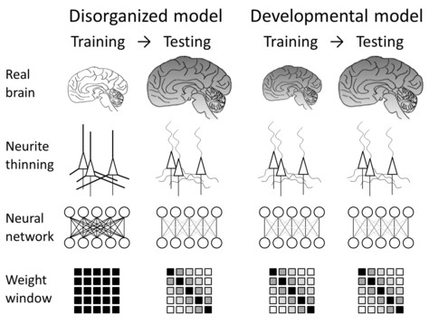
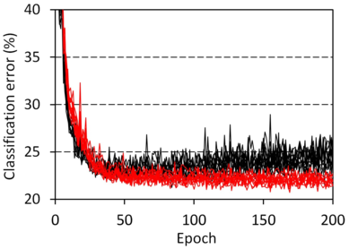

# Bio-mimetic layers

## Code used in our paper
under construction.

## The original schizophrenia-mimicking layer
The original schizophrenia-mimicking layer is based on our [study on nanometer-scale 3D structure of neuronal network in schizophrenia cases](https://www.nature.com/articles/s41398-019-0427-4). The synchrotron raditation nano-CT analysis revealed that neurites of the anterior cingulate cortex are thin and tortuous in schizophrenia compared to control cases. Analysis of another area called temporal cortex delineated [individual differences even between healthy controls](https://arxiv.org/abs/2007.00212). So we translated these findings into newly designed layers that mimic connection alteration in schizophrenia. <BR><BR>


Test calculations using the connection-constraint layer indicated that 80% of weights can be eliminated without any changes in training procedures or network configuration. Very interestingly the connection-constraint layer completely suppresses overfitting and outperforms fully connected layer. Here is a typical example obtained using [this python code](https://github.com/mizutanilab/schizo-nn/blob/master/paperfigs/CIFAR10_CNNSchizo200910.py) with slight changes of num_epoch=200, idlist=\[0.5, 0.0\] and num_repeat=10. Over 60% of kernel weights of convolution layers can be zeroed with the same method without any accuracy loss. This study was published in <a href="http://journal.frontiersin.org/article/10.3389/fnbot.2022.851471/full?&utm_source=Email_to_authors_&utm_medium=Email&utm_content=T1_11.5e1_author&utm_campaign=Email_publication&field=&journalName=Frontiers_in_Neurorobotics&id=851471">Front Neurorobot</a>.<BR><BR>


## How to implement the biomimetic layer in your network
Our code runs on Tensorflow/Keras. Connection-constraint versions of fully connected layer and 2D convolution layer are available. Their usage is completely the same with official Keras layers, except for specifying parameter reduction ratio and its method. The default reduction ratio is 50%. The default reduction method is `form='diagonal'`. 
1. Download 'schizo.py' (Tensorflow 2.15) file from <a href="https://github.com/mizutanilab/schizo-nn">our repository</a> to your working directory where your *.py file is placed. You can also find schizo.py files for older TF versions (Tensorflow 2.3 and 2.7). If you use them, download one of those versions compatible with your TF environment and rename the 'schizo_tf2.x.py' file to 'schizo.py'. 
2. The following is an example code using a 'SzDense' layer in place of 'Dense' layer: 
```
from tensorflow import keras
from tensorflow.keras import layers
import schizo

model = keras.Sequential([
  layers.Flatten(),
  # layers.Dense(512, activation='relu', kernel_initializer='he_normal'),
  schizo.SzDense(512, param_reduction=0.5, activation='relu', kernel_initializer='he_normal'),
  layers.Dense(num_class, activation='softmax')
])
```
In this example, the `layers.Dense` layer was commented out to replace it with a `schizo.SzDense` layer of 50% parameter reduction, which is defined with argument `param_reduction`. The reduction ratio best fit to your network depends on network configuration, but in most cases 50-70% seems to give good results. We recommend 50% as a first choice. No other modification of your python code is required. 

## Release notes
2024.3.30 Update: schizo.py compatible with TensorFlow 2.15<BR>
2022.3.28 Published in <a href="https://doi.org/10.3389/fnbot.2022.851471">Front Neurorobot</a>.<BR>
2022.1.22 Update: schizo.py compatible with TensorFlow 2.8<BR>
2020.10.3 Diagonal window of schizophrenia layer is now released.<BR>
2020.9.27 Revised accroding to official Keras implementations.<BR>
2020.9.24 Original release.

## References
Mizutani et al (2022). Schizophrenia-mimicking layers outperform conventional neural network layers. <i>Front. Neurorobot.</i> <b>16</b>, 851471. <a href="https://doi.org/10.3389/fnbot.2022.851471">DOI</a><BR>
Mizutani et al (2021). Structural diverseness of neurons between brain areas and between cases. <I>Transl. Psychiatry</I> <B>11</B>, 49. 
 <a href="https://doi.org/10.1038/s41398-020-01173-x">DOI</a>
 <a href="https://www.nature.com/articles/s41398-020-01173-x.pdf">pdf</a><BR>
Mizutani et al. (2020) Schizophrenia-mimicking layers outperform conventional neural network layers. [arXiv](https://arxiv.org/abs/2009.10887)<BR>
Mizutani et al. (2019) Three-dimensional alteration of neurites in schizophrenia. <i>Transl Psychiatry</i> <b>9</b>, 85. [nature.com](https://www.nature.com/articles/s41398-019-0427-4)

